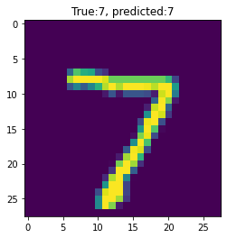
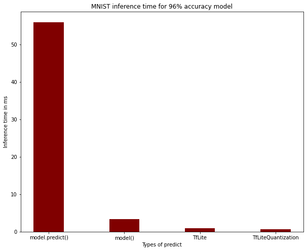

# Model Quantization Tutorial

TensorflowLite is a set of tools developed by Google that enables faster inference and smaller models for edge applications. 

In many use cases inference time is a huge requirement, also in edge applications such as mobile, IoT, ... memory and battery concerns play a big role as well. 

There are different types of tecniques that enable this, the main two are:
- Post Trainning Quantization
- During trainning Quantization

The difference between thw two is that the first reduces the size of the weights from float32 to smallwer sizes (up to int8) after trainning while the latter does this during training. 

The main advantage of this last technique is that, in some circunstances allows the model to adjust to the new weights precises which enables a smaller model accuracy deteoration. 

# Post Training Example

 ## Using MNIST


```python
!pip install tensorflow
```


```python
# Package installation

import logging
logging.getLogger("tensorflow").setLevel(logging.DEBUG)

import tensorflow as tf
from tensorflow import keras
import numpy as np
import pathlib
```

    2022-09-10 08:54:23.440146: I tensorflow/core/platform/cpu_feature_guard.cc:193] This TensorFlow binary is optimized with oneAPI Deep Neural Network Library (oneDNN) to use the following CPU instructions in performance-critical operations:  AVX2 FMA
    To enable them in other operations, rebuild TensorFlow with the appropriate compiler flags.
    2022-09-10 08:54:23.715410: W tensorflow/stream_executor/platform/default/dso_loader.cc:64] Could not load dynamic library 'libcudart.so.11.0'; dlerror: libcudart.so.11.0: cannot open shared object file: No such file or directory
    2022-09-10 08:54:23.715428: I tensorflow/stream_executor/cuda/cudart_stub.cc:29] Ignore above cudart dlerror if you do not have a GPU set up on your machine.
    2022-09-10 08:54:23.744533: E tensorflow/stream_executor/cuda/cuda_blas.cc:2981] Unable to register cuBLAS factory: Attempting to register factory for plugin cuBLAS when one has already been registered
    2022-09-10 08:54:28.718454: W tensorflow/stream_executor/platform/default/dso_loader.cc:64] Could not load dynamic library 'libnvinfer.so.7'; dlerror: libnvinfer.so.7: cannot open shared object file: No such file or directory
    2022-09-10 08:54:28.744705: W tensorflow/stream_executor/platform/default/dso_loader.cc:64] Could not load dynamic library 'libnvinfer_plugin.so.7'; dlerror: libnvinfer_plugin.so.7: cannot open shared object file: No such file or directory
    2022-09-10 08:54:28.744765: W tensorflow/compiler/tf2tensorrt/utils/py_utils.cc:38] TF-TRT Warning: Cannot dlopen some TensorRT libraries. If you would like to use Nvidia GPU with TensorRT, please make sure the missing libraries mentioned above are installed properly.


### Train tensorflow model


```python
# Load MNIST dataset
mnist = keras.datasets.mnist
(train_images, train_labels), (test_images, test_labels) = mnist.load_data()

# Normalize the input image so that each pixel value is between 0 to 1.
train_images = train_images / 255.0
test_images = test_images / 255.0

# Define the model architecture
model = keras.Sequential([
  keras.layers.InputLayer(input_shape=(28, 28)),
  keras.layers.Reshape(target_shape=(28, 28, 1)),
  keras.layers.Conv2D(filters=12, kernel_size=(3, 3), activation=tf.nn.relu),
  keras.layers.MaxPooling2D(pool_size=(2, 2)),
  keras.layers.Flatten(),
  keras.layers.Dense(10)
])

# Train the digit classification model
# According to the docs we should use crossentropy when Use this crossentropy loss function when there are two or more label classes.
model.compile(optimizer='adam',
              loss=keras.losses.SparseCategoricalCrossentropy(from_logits=True),
              metrics=['accuracy'])
model.fit(
  train_images,
  train_labels,
  epochs=1,
  validation_data=(test_images, test_labels)
)
```

    2022-09-10 08:55:56.337621: W tensorflow/stream_executor/platform/default/dso_loader.cc:64] Could not load dynamic library 'libcuda.so.1'; dlerror: libcuda.so.1: cannot open shared object file: No such file or directory
    2022-09-10 08:55:56.337643: W tensorflow/stream_executor/cuda/cuda_driver.cc:263] failed call to cuInit: UNKNOWN ERROR (303)
    2022-09-10 08:55:56.337672: I tensorflow/stream_executor/cuda/cuda_diagnostics.cc:156] kernel driver does not appear to be running on this host (FFPTL5CG0126KDT): /proc/driver/nvidia/version does not exist
    2022-09-10 08:55:56.337942: I tensorflow/core/platform/cpu_feature_guard.cc:193] This TensorFlow binary is optimized with oneAPI Deep Neural Network Library (oneDNN) to use the following CPU instructions in performance-critical operations:  AVX2 FMA
    To enable them in other operations, rebuild TensorFlow with the appropriate compiler flags.
    2022-09-10 08:55:56.574403: W tensorflow/core/framework/cpu_allocator_impl.cc:82] Allocation of 188160000 exceeds 10% of free system memory.


    1875/1875 [==============================] - 12s 6ms/step - loss: 0.2881 - accuracy: 0.9185 - val_loss: 0.1389 - val_accuracy: 0.9601


    <keras.callbacks.History at 0x7f7de709a890>


### Convert to tensorflow lite


```python
# here a special type of file is used to save the model. Just by converting to tf.lite we
# have gains in model size 
converter = tf.lite.TFLiteConverter.from_keras_model(model)
tflite_model = converter.convert()
```

    WARNING:absl:Found untraced functions such as _jit_compiled_convolution_op while saving (showing 1 of 1). These functions will not be directly callable after loading.


    INFO:tensorflow:Assets written to: /tmp/tmpyd_e1gsj/assets


    INFO:tensorflow:Assets written to: /tmp/tmpyd_e1gsj/assets
    2022-09-10 08:56:31.574311: W tensorflow/compiler/mlir/lite/python/tf_tfl_flatbuffer_helpers.cc:362] Ignored output_format.
    2022-09-10 08:56:31.574338: W tensorflow/compiler/mlir/lite/python/tf_tfl_flatbuffer_helpers.cc:365] Ignored drop_control_dependency.
    2022-09-10 08:56:31.574831: I tensorflow/cc/saved_model/reader.cc:45] Reading SavedModel from: /tmp/tmpyd_e1gsj
    2022-09-10 08:56:31.575838: I tensorflow/cc/saved_model/reader.cc:89] Reading meta graph with tags { serve }
    2022-09-10 08:56:31.575852: I tensorflow/cc/saved_model/reader.cc:130] Reading SavedModel debug info (if present) from: /tmp/tmpyd_e1gsj
    2022-09-10 08:56:31.578680: I tensorflow/compiler/mlir/mlir_graph_optimization_pass.cc:354] MLIR V1 optimization pass is not enabled
    2022-09-10 08:56:31.579424: I tensorflow/cc/saved_model/loader.cc:229] Restoring SavedModel bundle.
    2022-09-10 08:56:31.605130: I tensorflow/cc/saved_model/loader.cc:213] Running initialization op on SavedModel bundle at path: /tmp/tmpyd_e1gsj
    2022-09-10 08:56:31.611753: I tensorflow/cc/saved_model/loader.cc:305] SavedModel load for tags { serve }; Status: success: OK. Took 36924 microseconds.
    2022-09-10 08:56:31.624629: I tensorflow/compiler/mlir/tensorflow/utils/dump_mlir_util.cc:268] disabling MLIR crash reproducer, set env var `MLIR_CRASH_REPRODUCER_DIRECTORY` to enable.


### Check size


```python
tflite_models_dir = pathlib.Path("/tmp/mnist_tflite_models/")
tflite_models_dir.mkdir(exist_ok=True, parents=True)

tflite_model_file = tflite_models_dir/"mnist_model.tflite"
tflite_model_file.write_bytes(tflite_model)
```


    84820


### Perform Quantization


```python
converter.optimizations = [tf.lite.Optimize.DEFAULT]
tflite_quant_model = converter.convert()
tflite_model_quant_file = tflite_models_dir/"mnist_model_quant.tflite"
tflite_model_quant_file.write_bytes(tflite_quant_model)
```

    WARNING:absl:Found untraced functions such as _jit_compiled_convolution_op while saving (showing 1 of 1). These functions will not be directly callable after loading.


    INFO:tensorflow:Assets written to: /tmp/tmpi46zo0q5/assets


    INFO:tensorflow:Assets written to: /tmp/tmpi46zo0q5/assets
    2022-09-10 08:58:29.239486: W tensorflow/compiler/mlir/lite/python/tf_tfl_flatbuffer_helpers.cc:362] Ignored output_format.
    2022-09-10 08:58:29.239507: W tensorflow/compiler/mlir/lite/python/tf_tfl_flatbuffer_helpers.cc:365] Ignored drop_control_dependency.
    2022-09-10 08:58:29.239624: I tensorflow/cc/saved_model/reader.cc:45] Reading SavedModel from: /tmp/tmpi46zo0q5
    2022-09-10 08:58:29.240570: I tensorflow/cc/saved_model/reader.cc:89] Reading meta graph with tags { serve }
    2022-09-10 08:58:29.240583: I tensorflow/cc/saved_model/reader.cc:130] Reading SavedModel debug info (if present) from: /tmp/tmpi46zo0q5
    2022-09-10 08:58:29.243626: I tensorflow/cc/saved_model/loader.cc:229] Restoring SavedModel bundle.
    2022-09-10 08:58:29.268995: I tensorflow/cc/saved_model/loader.cc:213] Running initialization op on SavedModel bundle at path: /tmp/tmpi46zo0q5
    2022-09-10 08:58:29.275748: I tensorflow/cc/saved_model/loader.cc:305] SavedModel load for tags { serve }; Status: success: OK. Took 36125 microseconds.


    24064


```python
ls -lh {tflite_models_dir}
```

    total 108K
    -rw-r--r-- 1 tiago.cabo domain^users 24K set 10 08:58 mnist_model_quant.tflite
    -rw-r--r-- 1 tiago.cabo domain^users 83K set 10 08:57 mnist_model.tflite


### Inference time


```python
# Load model intro intrepreter
interpreter = tf.lite.Interpreter(model_path=str(tflite_model_file))
interpreter.allocate_tensors()
```

    INFO: Created TensorFlow Lite XNNPACK delegate for CPU.


```python
interpreter_quant = tf.lite.Interpreter(model_path=str(tflite_model_quant_file))
interpreter_quant.allocate_tensors()
```


```python
# Test using one image
test_image = np.expand_dims(test_images[0], axis=0).astype(np.float32)

input_index = interpreter.get_input_details()[0]["index"]
output_index = interpreter.get_output_details()[0]["index"]

interpreter.set_tensor(input_index, test_image)
interpreter.invoke()
predictions = interpreter.get_tensor(output_index)
```


```python
import matplotlib.pylab as plt

plt.imshow(test_images[0])
template = "True:{true}, predicted:{predict}"
_ = plt.title(template.format(true= str(test_labels[0]),
                              predict=str(np.argmax(predictions[0]))))
plt.grid(False)
```


    

    


```python
# Compare both models 
# A helper function to evaluate the TF Lite model using "test" dataset.
def evaluate_model(interpreter):
  input_index = interpreter.get_input_details()[0]["index"]
  output_index = interpreter.get_output_details()[0]["index"]

  # Run predictions on every image in the "test" dataset.
  prediction_digits = []
  for test_image in test_images:
    # Pre-processing: add batch dimension and convert to float32 to match with
    # the model's input data format.
    test_image = np.expand_dims(test_image, axis=0).astype(np.float32)
    interpreter.set_tensor(input_index, test_image)

    # Run inference.
    interpreter.invoke()

    # Post-processing: remove batch dimension and find the digit with highest
    # probability.
    output = interpreter.tensor(output_index)
    digit = np.argmax(output()[0])
    prediction_digits.append(digit)

  # Compare prediction results with ground truth labels to calculate accuracy.
  accurate_count = 0
  for index in range(len(prediction_digits)):
    if prediction_digits[index] == test_labels[index]:
      accurate_count += 1
  accuracy = accurate_count * 1.0 / len(prediction_digits)

  return accuracy
```


```python
print(evaluate_model(interpreter))

```

    0.9601


```python
# Repeat the evaluation on the dynamic range quantized model to obtain:
print(evaluate_model(interpreter_quant))

```

    0.9598


# Inference time


```python
results = {}

# Standard model 
import time
model.predict(test_images[0].reshape(1,28,28)) # First predict is slower
a = time.time()
model.predict(test_images[0].reshape(1,28,28))
b = time.time()
print(f"Standard batch predict took {(b-a)*1000} ms")

# Faster predict
a = time.time()
model(test_images[0].reshape(1,28,28))
b = time.time()
print(f"Faster standard predict took {(b-a)*1000} ms")

# TFLite model WITHOUT Quantization
interpreter = tf.lite.Interpreter(model_path=str(tflite_model_file))
interpreter.allocate_tensors()
a = time.time()
test_image = np.expand_dims(test_images[0], axis=0).astype(np.float32)

input_index = interpreter.get_input_details()[0]["index"]
output_index = interpreter.get_output_details()[0]["index"]

interpreter.set_tensor(input_index, test_image)
interpreter.invoke()
predictions = interpreter.get_tensor(output_index)
b = time.time()
print(f"TFLite without Quantization predict took {(b-a)*1000} ms")

# With Quantization
interpreter = tf.lite.Interpreter(model_path=str(tflite_model_quant_file))
interpreter.allocate_tensors()
a = time.time()
test_image = np.expand_dims(test_images[0], axis=0).astype(np.float32)

input_index = interpreter.get_input_details()[0]["index"]
output_index = interpreter.get_output_details()[0]["index"]

interpreter.set_tensor(input_index, test_image)
interpreter.invoke()
predictions = interpreter.get_tensor(output_index)
b = time.time()
print(f"TFLite with Quantization predict took {(b-a)*1000} ms")
```

    1/1 [==============================] - 0s 22ms/step
    1/1 [==============================] - 0s 19ms/step
    Standard batch predict took 56.53953552246094 ms
    Faster standard predict took 3.369569778442383 ms
    TFLite without Quantization predict took 0.9138584136962891 ms
    TFLite with Quantization predict took 0.6895065307617188 ms


```python
results = {"model.predict()": 56, "model()":3.37,"TfLite":0.91, "TfLiteQuantization":0.69}

```


```python
import numpy as np
import matplotlib.pyplot as plt
 
predicts = list(results.keys())
values = list(results.values())
  
fig = plt.figure(figsize=(10,8))
 
# creating the bar plot
plt.bar(predicts, values, color ='maroon',
        width = 0.4)
 
plt.xlabel("Types of predict")
plt.ylabel("Inference time in ms")
plt.title("MNIST inference time for 96% accuracy model")
plt.show()
```


    

    


# Conclusion 

Comparing the values above we see that the accuracy of the model was not affected significantly. 

The main issues that I found so far is the case when the model have layers with dynamic inputs. In that case we need to manual set the shema of the interpreter layers. 


```python

```
